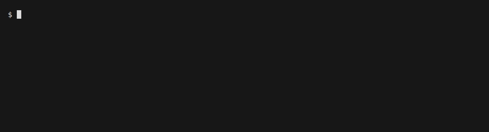

<div align="center">

# minesweeper

**Terminal Minesweeper with a testable game core separated from the TUI.**

Classic rules — first-click safety, flood fill, chord, timer, high scores —
plus shareable board seeds, a daily challenge, and boards that can be cleared
without ever guessing.

[](https://github.com/TF0119/minesweeper/actions/workflows/ci.yml)
[](https://github.com/TF0119/minesweeper/releases/latest)
[](https://github.com/TF0119/minesweeper/stargazers)
[](https://goreportcard.com/report/github.com/TF0119/minesweeper)
[](https://pkg.go.dev/github.com/TF0119/minesweeper)
[](LICENSE)



</div>

## Install

```bash
# Homebrew (macOS and Linux)
brew install TF0119/tap/minesweeper

# Scoop (Windows)
scoop bucket add TF0119 https://github.com/TF0119/scoop-bucket
scoop install minesweeper

# Go 1.25+
go install github.com/TF0119/minesweeper/cmd/minesweeper@latest
```

Or download a binary for your platform from the
[releases page](https://github.com/TF0119/minesweeper/releases/latest).

`go install` puts the binary in `$(go env GOPATH)/bin` — usually `~/go/bin`, which has to be
on your `PATH`. Running the same command again upgrades to the newest tagged
release; `@latest` follows release tags, not `main`. Check what you have with
`minesweeper -version`.

## Usage

```bash
minesweeper                          # last difficulty, random board
minesweeper -difficulty expert
minesweeper -difficulty custom -width 20 -height 10 -mines 30
minesweeper -daily                   # today's challenge, same board for everyone
minesweeper -seed 1487233901         # replay a specific board
minesweeper -no-guess=false          # allow boards that can need a guess
minesweeper -theme dark              # classic, dark or colorblind
minesweeper -no-color
```

Settings, high scores, statistics, and an unfinished game live in
`~/.config/minesweeper/`. Options
are resolved in one order: built-in defaults, then the config file, then
command-line flags. `-no-guess` and `-theme` are remembered for next time; turn
no-guess back off with `-no-guess=false`.

### Seeds and the daily challenge

Every board is generated from a seed shown in the status line. Pass that number
back with `-seed` to replay the exact same layout, or press `r` in game to retry
the board you just lost. `-daily` derives the seed from the current UTC date, so
everyone who plays on the same day with the same difficulty and no-guess setting
gets the same seed. Seeds pin the mine layout, not your first click: the opening
move is always safe, so the same seed can still start differently depending on
where you click.

Clearing a board shows a three-line share card (date or seed, difficulty and
time, and the project URL). Quitting from that victory screen prints the same
card to the terminal so it can be pasted into a chat.

### No-guess boards

Minesweeper normally ends some games on a coin flip. Of 200 random Expert boards,
only 13 can be cleared by reasoning alone, so this game does not deal them. The
generator keeps laying out mines until it finds one its solver can finish using
nothing but the deductions a player makes — counting neighbours, comparing
overlapping numbers, and watching the mine counter. This is the default; pass
`-no-guess=false`, or turn it off in Settings, for ordinary boards.

The search costs a few tens of milliseconds on the opening click, and every
preset difficulty yields to it: 200 boards each of Beginner, Intermediate, and
Expert were all solvable. It only comes up empty on dense custom boards, from
roughly a third of the cells mined upward, where such a layout may not exist at
all. When that happens the board is still playable and the status line says
`guess needed` rather than pretending otherwise.

### Statistics

Press `s` for wins, win rate, average winning time, best time, and streaks per
difficulty. Only finished games count, so starting a fresh board mid-game is not
a loss. Beating your best time shows a brief `new best` notice.

### Menu and timelapse

Launch drops you straight into a game — there is no title screen. Press `m` or
`Esc` during play to open the menu: new game, daily challenge, difficulty,
statistics, settings, help, and quit are all there.

Finished games are saved automatically (newest 20 kept on disk). Menu → **Watch**
lists them by difficulty, result, time, move count, and date; no-guess games are
marked. Pick one and the moves play back as a **timelapse** (about three moves
per second by default). `Space` pauses, `+`/`-` changes speed, `r` restarts,
`Enter` replays when finished, `x` deletes the selected recording. This is not
the same as `r` during play, which restarts the same seed so you can try again.

Settings in the menu cover theme, no-guess boards, question marks, and emoji
glyphs — the same options as the config file and flags.

### Picking up where you left off

Quitting in the middle of a game saves it. Start `minesweeper` again with no
arguments and the same board comes back, with your flags, your revealed cells,
and the clock continuing from where it stopped. Finishing a game clears the
save, so a board you already won never reappears. Starting a fresh board with
`n`, New game, Daily challenge, or a difficulty change also clears it
immediately.

Asking for a particular board skips the saved game — `-seed`, `-daily`,
`-difficulty`, and custom size flags all mean "deal this one instead". Preference
flags such as `-no-guess` and `-theme` do not: they update settings and the
unfinished game still resumes. Press `n` at any time for a fresh board.

## Controls

| Key | Action |
|-----|--------|
| Arrows / `hjkl` | Move cursor |
| Space / Enter | Reveal |
| `f` | Mark: flag → `?` → clear |
| `c` | Chord (reveal neighbours once flags match the number) |
| `m` / Esc | Menu |
| `n` | New board |
| `r` | Restart the same seed (play again) |
| `d` | Difficulty menu |
| `s` | Statistics |
| `?` | Help |
| `q` / Ctrl+C | Quit |

Menu → Watch: `Enter` starts a timelapse, `x` deletes the selected recording,
`Esc` / `q` goes back. During a timelapse: `Space` pauses, `+`/`-` changes
speed, `r` restarts playback, `Esc` / `q` returns to the list.

A `?` is only a note to yourself: it does not stop a reveal and does not count
towards a chord. Set `"question_marks": false` in the config to make `f` a plain
flag toggle.

Mouse: left click reveals, right click or Shift+left click marks, middle click
chords. Some terminals (notably Windows Terminal and WSL) intercept right-click
for paste, so Shift+left click is the reliable mark option there.

Boards larger than the window scroll to follow the cursor, so Expert works on
small terminals. Cell state never depends on colour alone, so `-no-color`,
`NO_COLOR=1`, and monochrome terminals stay playable. `-theme colorblind` uses
the Okabe-Ito palette, where no two adjacency digits collapse into the same
colour under the common forms of colour blindness.

## Architecture

Game rules live in `internal/game`, a package with no TUI dependencies and full
unit-test coverage. The bubbletea layer translates input and draws; it never sees
mine positions, only the `CellView` projection.

```
cmd/minesweeper → internal/ui → internal/game
                              → internal/storage
```

See [docs/design.md](docs/design.md) for the design decisions behind the split.

## Development

```bash
make test     # go test -race ./...
make build    # binary at bin/minesweeper
make lint     # gofmt, go vet, golangci-lint
make demo     # re-record docs/demo.gif (needs vhs)
```

Contributions are welcome — see [CONTRIBUTING.md](CONTRIBUTING.md) for the
workflow and [docs/design.md](docs/design.md) for the reasoning you are expected
to work with.

## License

[MIT](LICENSE) © Takeru Fukuda
